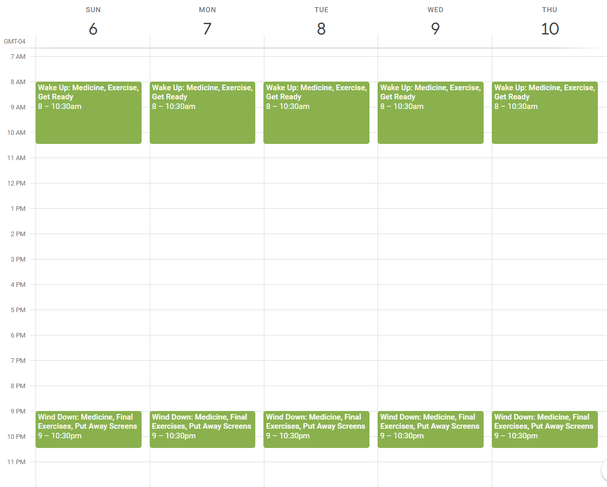

Hello, neurospicy readers and neurotypical wanderers.  I am a late diagnosed member of the ADHD Combined Type club, coming to this chapter in my mental health journey just a few years ago.  My diagnosis set off a domino effect of new medications, therapists, and psychiatrists as I sought a new way to move through my life without overwhelming internal struggles.

Since I was young, I always took fastidious notes to compensate for my memory, which seemed to betray me without rhyme or reason during school and my professional life.  I created ways to track and repeat tasks, witnessing firsthand days where I would forget everything - even the daily vitamins I had taken for years prior - without a reminder.

Despite this, I found that a rigid schedule with assigned tasks and times was an unbearable system to work through.  I couldn't keep myself exactly on time on off-days, often jumping in too early or too late from what I had set for myself to achieve.  I kept failing myself at my own systems!  I knew I had to find an entirely new way.

This is about the foundation of a new method for those who need to get done so many things, yet struggle with repetition and normalcy.  I have been doing this for weeks now with success, without having a name recognized for it or a conscious knowledge of it.

### A new operating system.

I lovingly refer to ADHD as an operating system.  This originates from a brief Facebook clip of a brilliant autistic women (I hope to find that clip again and link it here) who spoke to a panel of neurotypical professionals, wishing aloud that those with different minds would simply be considered a different phone type, like an Android or an iPhone, rather than fundamentally flawed.  I agree with this assessment.  There are limitless examples of fascinating neurodivergent business owners, creators, and inventors who have found their way to success through leveraging their mind's operating system, rather than staying mired in the downsides.

This is easier said than done, though.  On my best days, I aspire to do good with my time - to do something that moves me or my work forward.  On my worst days, I am frustrated by my lack of executive functioning, working through my dopamine menus and anything I have at hand to seek *something* that will get me unstuck.  There were many days when I didn't find that answer at all.

However, I want to offer something that has been consistently helping me.  This system of scheduling has helped me with both moving forward mentally, alongside new physical challenges I have related to my joints and mobility that are unfortunately new to me this year.  On top of starting a new business, helping with a beloved non-profit, and being a mother and wife, I was hellbent on uncovering a new way to approach my day and getting things done.

### A new method, Step One: Determining what is non-negotiable in your day.
This looks different for every person.  In my case, I have struggled in particular with exercising consistently.  My day now has time on an exercise bike for about 30 minutes in the mornings, which leads directly to a refreshing shower.  This, combined with taking medicine in specific time ranges of the day, are my required, repeating daily tasks.

### Step Two: Decide what tasks can be grouped together, and when.
This is key.  Instead of having time blocks for each specific task, consider what goes together well.  Do you feed a pet right when you get up in the morning, and usually take morning vitamins right after because the pill bottle is also in the kitchen?  Identifying these pairs and groups of activities is key.

Depending on how you like to schedule things, whether in a paper planner or a digital calendar, take note of these groupings.  Here's what my repeating events look like:

### Step Three: Allow yourself enough time to do things out of order, or with variation.
I believe this is the key to getting things done within time buckets as an ADHD person.  I need to feel that I have some free will, or flexibility, in what I do and when.  However, having no rails at all leads to days where very little of what I've planned gets done.  I know what must get done, but having agency over how and when, even if the flexibility is important, is crucial.

For example, a recent exercise session was a combined meditation *and* bike exercise for a half-hour using an instructor-led YouTube video.  I had never done this before, but I knew that I had dedicated time for exercise, so trying a *new* kind of exercise was absolutely in range, and still met my core needs.  The newness brought the novelty I craved to my morning.

There are other times when I have played an audiobook while exercising or taking vitamins, or otherwise combined novelty with what needed to get done.  This helps each day feel like less of a repeat, while still meeting my health needs.

### Expanding on the idea.
If you are inclined, you can extend this concept to work, school, family, and many other sorts of tasks that often need to be completed within a set time or a set day.  Finding opportunities for combinations and flexibility is key!

You may also find that you need to adjust these time blocks to be longer or shorter as you go.  This is not only natural, but encouraged.  The idea here is to find the system that works *for you* in the best way possible, rather than matching a schedule I or anyone else on the internet shows you.

### The final revelation: What time is left?
This approach highlighted the inverse of my available time for me also.  If I am spending an hour or so every morning and every evening doing specific self-care tasks, then *what time is left for the rest?*  When you have your critical items blocked out, you may realize that there isn't as much time to do *all the things* as you are hoping for.

For me, there was a mourning time for how seemingly carefree my life was before parenthood, marriage, even my professional life.  It was all so free-flowing and creative.  I don't live in the past, though, so I know that it's incredibly important to see what the bounds are for my time.  This was a way to cull my task list down to what matters most.

### A foundation for dynamically doing what matters.
This approach took me considerable time to arrive at.  I have other systems of repeating tasks, setting priorities, and otherwise trying to cajole myself forward, but at the foundation is this setup.  I have a clear aversion to rigidity or overly-prescribing my day and task list, despite needing to balance so many categories of things to get done.